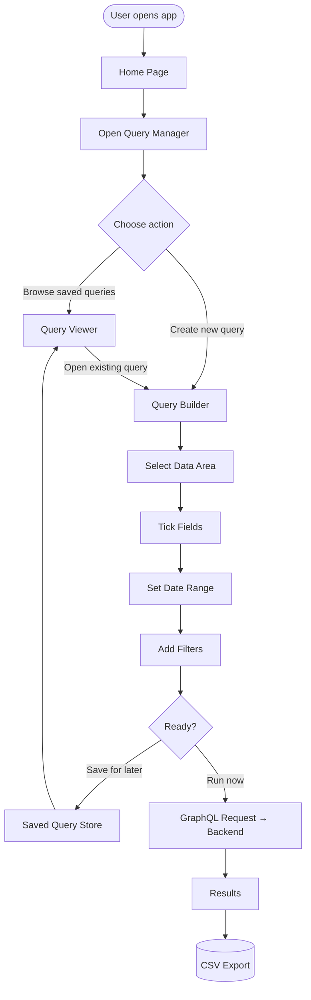
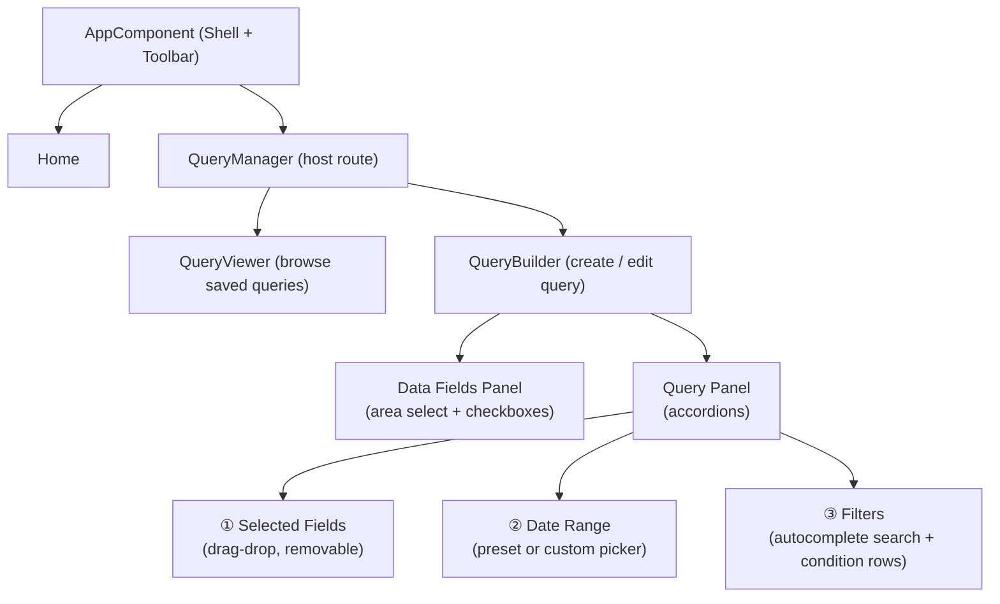

# Data Explorer UI

A dynamic, Angular-based query builder that lets users compose, save, and run GraphQL queries against a backend API — all through a guided, no-code interface.

---

## Table of Contents

- [Overview](#overview)
- [Features](#features)
- [Application Flow](#application-flow)
- [Component Architecture](#component-architecture)
- [Screen Layout](#screen-layout)
- [Routing](#routing)
- [Tech Stack](#tech-stack)
- [Getting Started](#getting-started)

---

## Overview

Data Explorer UI provides a visual interface for building structured GraphQL queries without writing a single line of query syntax. Users pick data areas (Person, Absence, Jobs), select fields, define date ranges, apply filters, and send the query to the backend. Results can be exported to CSV. Queries can be named, categorised, and saved for reuse.

---

## Features

| Feature | Description |
|---|---|
| 🧩 **Query Builder** | Select data areas and fields, configure date range and per-field filters |
| 🤖 **AI Assist** | Describe a query in plain English — AI builds the structure for you |
| 💾 **Save Queries** | Name and categorise queries for later reuse |
| 📂 **Query Viewer** | Browse saved queries by category with a live search bar |
| 🔀 **Drag & Drop Fields** | Reorder selected fields to control the output column order |
| 🗑️ **Removable Fields** | Remove individual fields from the query without leaving the builder |
| 📅 **Date Range Picker** | Choose Today / This Week / This Month or a fully custom date range |
| 🔍 **Field Filters** | Search any system field and apply conditions (equals, contains, is null, greater than, etc.) |
| 📤 **CSV Export** | *(planned)* Export query results directly to a CSV file |

---

## Application Flow



---

## Component Architecture



---

## Screen Layout

### Home
```
┌─────────────────────────────────────────────┐
│  🔷 Data Explorer                  🏠        │  ← toolbar
├─────────────────────────────────────────────┤
│  Data Explorer                              │
│  Build GraphQL queries with a guided UI…    │
│                                             │
│  What you can do                            │
│  • Compose queries with fields & filters    │
│  • Run queries against GraphQL backend      │
│  • Save query templates for reuse           │
│                                             │
│                    [ ▶ Open Query Manager ] │
└─────────────────────────────────────────────┘
```

### Query Builder
```
┌─────────────────────────────────────────────────────────────────┐
│  [✨ Describe your query…                         ] [🤖 AI Build]│
├───────────────────┬─────────────────────────────────────────────┤
│  Data Fields      │  Query                          [ 💾 Save ] │
│  ┌──── Area ───┐  │  ▼ ① Selected Fields  (2 fields chosen)     │
│  │ Person    ▼ │  │    ═══ First Name  ✕                        │
│  └─────────────┘  │    ═══ Email       ✕                        │
│  ─────────────    │  ▶ ② Date Range    (This Month)             │
│  ☐ ID             │  ▶ ③ Filters       (1 active filter)        │
│  ☑ First Name     │                                             │
│  ☐ Last Name      │                        [ ▶ Run Query ]      │
│  ☑ Email          │                                             │
│  ☐ Date of Birth  │                                             │
└───────────────────┴─────────────────────────────────────────────┘
```

### Query Viewer
```
┌──────────────────────────────────────────────────────────┐
│  [🔍 Search queries…                ] [ 📁 New Category ]│
├────────────────┬─────────────────────────────────────────┤
│  Categories    │  User Queries                           │
│  ─────────────│  ─────────────────────────────────────  │
│  📁 User       │  </> Get All Users                      │
│  📁 Product    │      Fetches all user records.          │
│  📁 Orders     │  </> Find User by ID                    │
│                │      Looks up a single user.            │
└────────────────┴─────────────────────────────────────────┘
```

---

## Routing

| Path | Component | Notes |
|---|---|---|
| `/` | `HomeComponent` | Default landing page |
| `/home` | `HomeComponent` | Alias |
| `/query-manager` | `QueryManagerComponent` | Hosts viewer + builder |
| `/**` | → `/` | Wildcard redirect |

---

## Tech Stack

| Layer | Technology | Version |
|---|---|---|
| Framework | Angular | 21.x |
| UI Components | Angular Material | 21.x |
| Drag & Drop | Angular CDK | 21.x |
| Styling | SCSS (BEM-style, component-prefixed) | — |
| Forms | Angular Reactive / Template Forms | — |
| Routing | Angular Router | — |
| Query Transport | GraphQL *(planned)* | — |
| Language | TypeScript | ~5.9 |

---

## Getting Started

### Install dependencies
```bash
npm install
```

### Run development server
```bash
npm start
```
Navigate to `http://localhost:4200`.

### Build for production
```bash
npm run build
```
Output is placed in `dist/data-explorer-ui`.

### Run tests
```bash
npm test
```

---

## SCSS Naming Convention

All component styles follow a **component-prefixed BEM-like** pattern:

```
.ComponentName-block-element--modifier
```

Examples:
- `.QueryBuilder-query-filters-row--active`
- `.Home-feature-item`
- `.QueryViewer-categories-item--active`

